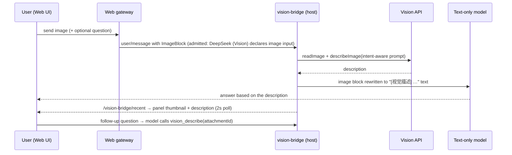

# dsh-visual-plugin

> **Vision bridge for [DeepSeek Harness](https://github.com/deepseek-ai/deepseek-harness)** — give your text-only model eyes. When the main model has no vision, user images are forwarded to any OpenAI-compatible vision model, and the results appear in a Web UI right panel.

[](https://www.npmjs.com/package/dsh-visual-plugin)
[](https://github.com/jyh20030112/dsh-visual-plugin/releases)
[](LICENSE)
[](https://github.com/topics/dsh-plugin)

[English](README.md) · [简体中文](README.zh.md)

> 🏗 Built on the [DeepSeek Harness](https://github.com/deepseek-ai/deepseek-harness) plugin framework — *everything is a plugin*.

---

## ✨ Features

- 🖼️ **Automatic image description** — images sent in the composer are intercepted at `agent/pre-step` and rewritten into `[视觉描述] <description>` text before they reach the text-only model.
- 💬 **Intent-aware prompts** — when you send an image *with a question*, the description is generated from your own words ("以该意图为重点…"), not a generic template.
- 🔎 **`vision_describe` tool** — the model can answer follow-up questions about any previously attached image.
- 🎛️ **Right-side panel** — configure `url` / `model` / `api_key`, test the connection, watch recent descriptions with thumbnails (2s auto-refresh), and read the remaining balance.
- 🔐 **Secrets stay secret** — the API key is stored through the harness credentials seam (write-only, never echoed, never in settings).
- 📦 **Publishable dual-half bundle** — one npm package with a host plugin and a browser half (`dsh.bundle` + `dsh.client`), installed with `dsh plugin add`.

## 🚀 Quick start

```sh
# install from npm (the official dsh plugin channel)
dsh plugin --profile web add dsh-visual-plugin
# …or from GitHub
dsh plugin --profile web add github:jyh20030112/dsh-visual-plugin
```

Then **restart** `dsh web`, open the UI and click **视觉桥接 / Vision Bridge** in the sidebar footer.

### 1. Configure the vision endpoint (in the panel)

| Field | Example |
|---|---|
| 接口地址 Endpoint URL | `https://api.deepseek.com` (any OpenAI-compatible `/chat/completions` base) |
| 模型名称 Model name | `glm-4v-flash`, `Qwythos`, … (a vision-capable model) |
| API Key | entered once, stored write-only |

Click **保存配置** → **测试连接** — a successful test shows latency.

### 2. Pick the conversation model

Select provider **DeepSeek (Vision)** in the Web model picker. That route is the plugin's wrapper adapter: it declares image input (so the gateway admits uploads) and delegates every request to the underlying `deepseek-official` adapter.

### 3. Send an image

Paste/drop an image (optionally with a question) → the model answers from the generated description, and the panel shows the thumbnail + description within ~2s.

## ⚙️ How it works



- API keys never leave the credentials seam; vision calls use `Authorization: Bearer`, `redirect: 'manual'`, a 60s timeout, and a normalized error vocabulary (`AUTH / QUOTA / RATE_LIMIT / TIMEOUT / NETWORK / PROTOCOL / HTTP / CONFIG`).
- Unconfigured or failed vision calls degrade to a `[视觉描述失败] <reason>` placeholder so the conversation never breaks.

## 🧱 Project layout

```
src/
  index.ts        host plugin: pre-step interception + vision_describe + HTTP routes
  vision.ts       OpenAI-compatible vision calls (describe / test / balance)
  config.ts       settings namespace `vision-bridge` + schema
  adapter.ts      deepseek-vision wrapper adapter (image-intake enabler, FR0)
  invariant.ts    invariant companion
  client/         browser half: panel / sidebar toggle / tool card / locales / css
cordis.patch.yml  bundle patch layer (inserts the vision-bridge row)
```

## 🛠 Development

<details>
<summary>Build from source</summary>

The plugin targets the **current** harness API — the npm-published `@deepseek-ai/*` packages are still `0.0.1-rc.1` (older API), so building requires a local harness checkout whose packages are installed and built:

```sh
# layout: <dev>/deepseek_workspace/dsh-visual-plugin + <dev>/deepseek-harness
npm run bootstrap   # symlink node_modules to the harness dependency tree
npm run typecheck   # tsc → lib/types (declarations)
npm run build       # tsdown → lib/index.js + lib/client.js
npm run pack        # inspect the publishable tarball
```

Prebuilt artifacts (`lib/`) are committed, so consumers never need to build.
</details>

## 📦 Publishing (CI/CD)

`.github/workflows/`:

| Workflow | Trigger | What it does |
|---|---|---|
| `ci.yml` | push / PR | Verifies committed artifacts, the `dsh` bundle/client manifest, and `npm pack` contents |
| `release.yml` | tag `v*` / manual | Version check → `npm pack` → GitHub Release + tarball → `npm publish` |

Release a new version:

```sh
# bump version in package.json (rebuild + commit lib/ if sources changed), then:
git tag v0.1.1 && git push origin v0.1.1   # triggers release.yml
```

Requires the `NPM_TOKEN` secret (granular access token, read-and-write, **bypass 2FA**) in repository **Settings → Secrets → Actions**.

## 📚 Resources

- [PRD v1.1](https://github.com/jyh20030112/dsh-visual-plugin/blob/main/docs/vision-bridge-prd.md) — requirements & design
- [DeepSeek Harness](https://github.com/deepseek-ai/deepseek-harness) — the plugin framework (everything is a plugin)

## 📄 License

[MIT](LICENSE)

[](https://github.com/deepseek-ai/deepseek-harness)
