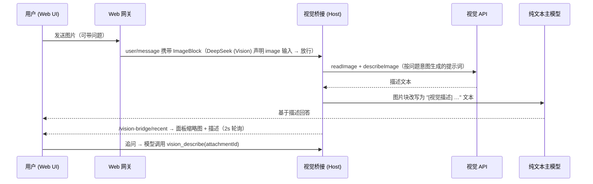

# dsh-visual-plugin

> **[DeepSeek Harness](https://github.com/deepseek-ai/deepseek-harness) 视觉桥接插件** —— 给纯文本模型装上眼睛。主模型没有视觉能力时，把用户图片转发给任意 OpenAI 兼容的视觉模型，并在 Web UI 右侧面板展示结果。

[](https://www.npmjs.com/package/dsh-visual-plugin)
[](https://github.com/jyh20030112/dsh-visual-plugin/releases)
[](LICENSE)
[](https://github.com/topics/dsh-plugin)

[English](README.md) · [简体中文](README.zh.md)

> 🏗 基于 [DeepSeek Harness](https://github.com/deepseek-ai/deepseek-harness) 插件框架构建 —— *一切皆插件*。

---

## ✨ 特性

- 🖼️ **自动描述图片** —— 输入栏发图后，`agent/pre-step` 拦截图片块，在到达纯文本模型前改写为 `[视觉描述] <描述>` 文本。
- 💬 **按问题定向描述** —— 发图同时带问题时，描述提示词由你的原话生成（"以该意图为重点…"），而不是固定模板。
- 🔎 **`vision_describe` 工具** —— 模型可以对任意已附图追问细节。
- 🎛️ **右侧面板** —— 配置 `url` / `model` / `api_key`、测试连接、查看最近描述（缩略图 + 2 秒自动刷新）、剩余额度。
- 🔐 **密钥不落地** —— API Key 经 harness credentials 缝存储（只写不回显、不进 settings、不落模型上下文）。
- 📦 **可发布双端 bundle** —— 一个 npm 包同时含 Host 插件与浏览器半（`dsh.bundle` + `dsh.client`），`dsh plugin add` 一键安装。

## 🚀 快速开始

```sh
# 从 npm 安装（dsh 官方插件分发渠道）
dsh plugin --profile web add dsh-visual-plugin
# …或从 GitHub 安装
dsh plugin --profile web add github:jyh20030112/dsh-visual-plugin
```

**重启** `dsh web` 后打开界面，点击侧栏底部 **视觉桥接 / Vision Bridge**。

### 1️⃣ 配置视觉端点（面板里）

| 字段 | 示例 |
|---|---|
| 接口地址 Endpoint URL | `https://api.deepseek.com`（任意 OpenAI 兼容 `/chat/completions` 端点） |
| 模型名称 Model name | `glm-4v-flash`、`Qwythos`……（视觉模型） |
| API Key | 只填一次，只写存储 |

点 **保存配置** → **测试连接** —— 成功会显示延迟。

### 2️⃣ 选择对话模型

在 Web 模型选择器里切到 **DeepSeek (Vision)**。这个路由是插件的包装适配器：声明支持图片输入（网关放行上传），并把每次请求委托给底层 `deepseek-official` 适配器。

### 3️⃣ 发图

粘贴/拖拽一张图片（可附带问题）→ 主模型基于生成的描述作答，面板约 2 秒内出现缩略图 + 描述。

## ⚙️ 工作原理



- API Key 永不离开 credentials 缝；视觉调用带 `Authorization: Bearer`、`redirect: 'manual'`、60s 超时，错误归一化词汇 `AUTH / QUOTA / RATE_LIMIT / TIMEOUT / NETWORK / PROTOCOL / HTTP / CONFIG`。
- 未配置或调用失败时降级为 `[视觉描述失败] <原因>` 占位文本，对话不会中断。

## 🧱 项目结构

```
src/
  index.ts        host 插件：pre-step 拦截 + vision_describe + HTTP 路由
  vision.ts       OpenAI 兼容视觉调用（describe / test / balance）
  config.ts       settings 命名空间 `vision-bridge` + schema
  adapter.ts      deepseek-vision 包装适配器（图片入站使能，FR0）
  invariant.ts    invariant 伴随
  client/         浏览器半：面板 / 侧栏开关 / 工具卡片 / 文案 / 样式
cordis.patch.yml  bundle 补丁层（插入 vision-bridge 行）
```

## 🛠 开发

<details>
<summary>从源码构建</summary>

插件针对**当前** harness API 构建——npm 上发布的 `@deepseek-ai/*` 还是 `0.0.1-rc.1`（旧 API），因此构建需要一个已安装并构建好的本地 harness 检出：

```sh
# 目录布局：<dev>/deepseek_workspace/dsh-visual-plugin + <dev>/deepseek-harness
npm run bootstrap   # 将 node_modules 符号链接到 harness 依赖树
npm run typecheck   # tsc → lib/types（类型声明）
npm run build       # tsdown → lib/index.js + lib/client.js
npm run pack        # 查看可发布 tarball 内容
```

预构建产物（`lib/`）已提交，使用者无需构建。
</details>

## 📦 发布（CI/CD）

`.github/workflows/`：

| 工作流 | 触发 | 做什么 |
|---|---|---|
| `ci.yml` | push / PR | 校验提交的产物、`dsh` bundle/client 清单、`npm pack` 内容 |
| `release.yml` | tag `v*` / 手动 | 版本校验 → `npm pack` → GitHub Release + tarball → `npm publish` |

发布新版本：

```sh
# 修改 package.json 版本号（如有源码改动先重新构建并提交 lib/），然后：
git tag v0.1.1 && git push origin v0.1.1   # 触发 release.yml
```

需要仓库 **Settings → Secrets → Actions** 里的 `NPM_TOKEN` secret（granular access token，读写权限，**bypass 2FA**）。

## 📚 相关资源

- [PRD v1.1](docs/vision-bridge-prd.md) —— 需求与设计文档
- [DeepSeek Harness](https://github.com/deepseek-ai/deepseek-harness) —— 插件框架（一切皆插件）

## 📄 许可证

[MIT](LICENSE)

[](https://github.com/deepseek-ai/deepseek-harness)
